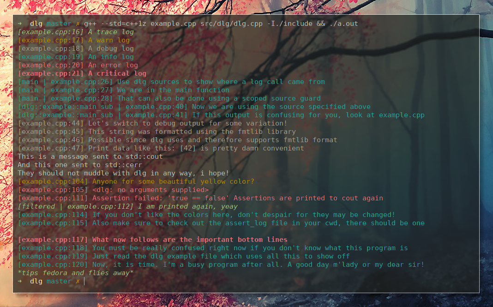

dlg
===

Just another lightweight logging library with C and C++ api.
Pretty much everything can be configured (kinda like bring your own outputting
and formatting and filtering system and handle all the additional 
fancy stuff yourself, but only if you want to, otherwise we got some 
pretty nice defaults for you).

I tried hard to keep the amount of unneeded bullshit to a minimum (*adding loc 
amount to convince you here, pretty hard to write much bullshit besides a 
well-documented logging interface in a few hundred lines*):

There are 3 headers:
	- <dlg/dlg.h> (around 200 loc): Everything you need, no dependencies
	- <dlg/output.h> (around 100 loc): Utilities for implementing custom output handlers
	- <dlg/dlg.hpp> (around 200 loc): Modern C++11 utilities, alternative formatter

You can either build dlg.c as library or include it directly into your project 
(nothing else needed).
The name stands for some kind of super clever word mixture of the words 'debug' 
and 'log' (think of something yourself, duh).

Can be built with cmake or meson (please consider jumping onto the meson train though,
at some point i may no longer want to maintain the cmake version).

## Show me something fancy already

Besides a simple look into the [headers](include/dlg), have a look into the 
__[summary](docs/v0.1.md)__ and additional documentation for the latest release.

Thousands words, explanations and pictures don't say as much as a single __[code example](docs/examples/example.cpp)__ though.

Nontheless a rather beautiful picture of dlg in action for you. It is probably rather nonsensical without
having read the example though:

Note though that dlg can be used without weird dummy messages as well.
Building the sample can be enabled by passing the 'sample' argument as true to meson.

__Contributions of all kind are welcome, this is nothing too serious though (kinda like life)__
